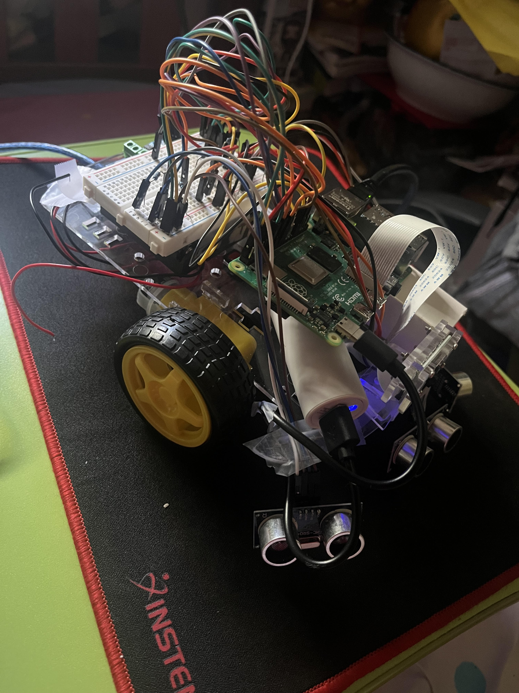
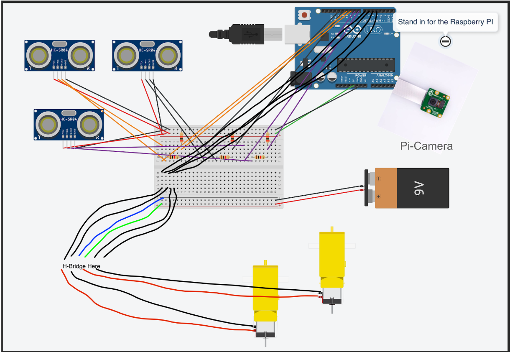

# Ball Tracking Robot
The main purpose of this robot is as the name suggest to track a ball that the robot sees. While this might have seemed simple, I had to no clue what I was getting myself into. I encounter more bumbs and setbacks in this one month journey than in my entire year of school. Subsequently, this month had just as many triumphs. Follow along to see how my engineering endeavor played out.

| **Engineer** | **School** | **Area of Interest** | **Grade** |
|:--:|:--:|:--:|:--:|
| Lin Yu Z. | University Neighborhood High School | Computer Science/Mechanical Engineering | Class of 2025




# First Milestone

<iframe width="560" height="315" src="https://www.youtube.com/embed/Mhk0i07Dayw?si=X08mbKZW4ChSZC8N" title="YouTube video player" frameborder="0" allow="accelerometer; autoplay; clipboard-write; encrypted-media; gyroscope; picture-in-picture; web-share" referrerpolicy="strict-origin-when-cross-origin" allowfullscreen></iframe>

While many of peers had their first milestone done by the first week, It took me much into my second week to finish my first milestone. This first milestone consisted of a working ultrasonic sensor, camera, four directions of motion via motors, amd a lot of headches. From day 1, my raspberrypi was giving me trouble and rejecting connecting. I eventually got around this obstacle by learning how to connect the raspberrypi through a serial connection, which allowed me to code on the raspberrypi through my computer's terminal. After much time and headaches, I had finally completed my first milestone.

# Second Milestone

<iframe width="560" height="315" src="https://www.youtube.com/embed/u4_pBEQbDHg?si=RhV7iLe4yhZ8hits" title="YouTube video player" frameborder="0" allow="accelerometer; autoplay; clipboard-write; encrypted-media; gyroscope; picture-in-picture; web-share" referrerpolicy="strict-origin-when-cross-origin" allowfullscreen></iframe>

My main goal for the second milestone was to finish the image processing software. This software would allow the pi-camera to take in a live feed, the raspberry pi would take in that live feed and add a mask over it. This would allow for the robot to only see the red ball in the video feed. This was surprisingly hard since I had to figure out the color spectrum that the pi-camera uses, finding the color color range that would allow me to properly highlight the red ball. Additionally, using this image processing I was also able to locate and find the size of ball with respect to the camera. This was the final step I needed to start navigating the robot to the ball.

# Final Milestone

<iframe width="560" height="315" src="https://www.youtube.com/embed/0G6uf83iPzY?si=aS4TiJD4cnNeXeQc" title="YouTube video player" frameborder="0" allow="accelerometer; autoplay; clipboard-write; encrypted-media; gyroscope; picture-in-picture; web-share" referrerpolicy="strict-origin-when-cross-origin" allowfullscreen></iframe>

FInally, after 3 weeks of blood sweat and tears, the robot was inally done. It effectively uses the camera to detect the ball, then sends the directions to the motors to move the robot to the ball. I had my fair share of ups and downs. I had trouble with my raspberry-pi, the wiring of ultrasonic sensors, and even the image processing was being weird. However, there were equal amounts of wins. I learned to code through the serial to get around the raspberry-pi problem and I figured out that all these problems that all required a simple fix. Whether it was missing a delay or a miswire. Throughout my time here at BlueStamp I truly learn so much. To persevere through adversity, to never give up, and to believe in myself. These lessons that I take from BlueStamp are priceless.

# Schematics 
Here's where you'll put images of your schematics. [Tinkercad](https://www.tinkercad.com/blog/official-guide-to-tinkercad-circuits) and [Fritzing](https://fritzing.org/learning/) are both great resoruces to create professional schematic diagrams, though BSE recommends Tinkercad becuase it can be done easily and for free in the browser. 



# Code

```python
import cv2 #OpenCV
from picamera2 import Picamera2, Preview
import RPi.GPIO as gpio
from gpiozero import DistanceSensor
import time
import numpy as np


def ultrasonic1():
    ultrasonic = DistanceSensor(echo=24, trigger=23)
    return(ultrasonic.distance*100)
        
def ultrasonic2():
    ultrasonic = DistanceSensor(echo=9,trigger=10)
    return(ultrasonic.distance*100)
        
def ultrasonic3():
    ultrasonic = DistanceSensor(echo=21,trigger=20)
    return(ultrasonic.distance*100)
    
def init():
    gpio.setmode(gpio.BCM)
    gpio.setup(17,gpio.OUT)
    gpio.setup(22,gpio.OUT)
    gpio.setup(6,gpio.OUT)
    gpio.setup(5,gpio.OUT)
    
def forward(sec):
    init()
    gpio.output(17, True)
    gpio.output(22, False)
    gpio.output(6, True)
    gpio.output(5, False)
    time.sleep(sec)
    gpio.cleanup()
    
def reverse(sec):
    init()
    gpio.output(17, False)
    gpio.output(22, True)
    gpio.output(6, False)
    gpio.output(5, True)
    time.sleep(sec)
    gpio.cleanup()
    
def left(sec):
    init()
    gpio.output(17, True)
    gpio.output(22, False)
    gpio.output(6, False)
    gpio.output(5, True)
    time.sleep(sec)
    gpio.cleanup()
    
def right(sec):
    init()
    gpio.output(17, False)
    gpio.output(22, True)
    gpio.output(6, True)
    gpio.output(5, False)
    time.sleep(sec)
    gpio.cleanup()
    
def stop():
    init()
    gpio.output(17, False)
    gpio.output(22, False)
    gpio.output(6, False)
    gpio.output(5, False)
    time.sleep(1)

def segment_colour(frame):

    hsv_roi =  cv2.cvtColor(frame, cv2.COLOR_RGB2HSV)
    
    mask_1 = cv2.inRange(hsv_roi, np.array([155, 190,1]), np.array([190,255,255])) 
    
    mask = mask_1
    kern_dilate = np.ones((12,12),np.uint8)
    kern_erode  = np.ones((10,10),np.uint8)
    mask= cv2.erode(mask, kern_erode)
    mask= cv2.dilate(mask, kern_erode)
    mask= cv2.dilate(mask, kern_dilate)
    mask= cv2.dilate(mask, kern_dilate)

    return mask

def find_blob(blob):  
    largest_contour=0
    cont_index=0
    contours, hierarchy = cv2.findContours(blob, cv2.RETR_CCOMP, cv2.CHAIN_APPROX_SIMPLE)
    for idx, contour in enumerate(contours):
        area=cv2.contourArea(contour)
        if (area >largest_contour):
            largest_contour=area
            cont_index=idx
                    
    r=(0,0,2,2)
    if len(contours) > 0:
        r = cv2.boundingRect(contours[cont_index])
     
    return r,largest_contour 

picam2 = Picamera2()
camera_config = picam2.create_still_configuration(main={"size": (1920, 1080)}, lores={"size": (480, 270)}, display="lores")

picam2.configure(camera_config)
picam2.start()

time.sleep(2) 

while(True):
    print(ultrasonic2())

    im = picam2.capture_array()
    height = im.shape[0]
    width = im.shape[1]
    
#fucntion 1 segment_colour
    mask_red = segment_colour(im)
    mask_red = mask_red.astype(np.uint8)
    cv2.imshow("Testy", mask_red)
    cv2.waitKey(1)

#fucntion 2 find_blob
    loct,area = find_blob(mask_red)
    print(area)
    
    if ((((loct[0]+loct[2])<1450) and ((loct[0]+(loct[2]/2))>450)) or (area>800000)):
        if (area<800000):
            forward(.75)
            print("Moving Forward")
        else:
            print("Ball Found")
            stop()
            break
    elif ((loct[0]+loct[2])>1000):
        right(.3)
        stop()
        print("Turning Right")
    elif ((loct[0]+(loct[2]/2))<700):
        left(.15)
        stop()
        print("Turning Left")
```

# Bill of Materials

| **Part** | **Note** | **Price** | **Link** |
|:--:|:--:|:--:|:--:|
| Raspberry Pi Kit | The primarily device that is in charge of controlling the robot | $95.19 | <a href="https://www.amazon.com/RasTech-Raspberry-Starter-Heatsink-Screwdriver/dp/B0C8LV6VNZ/ref=sr_1_4?crid=3506HY00MCGVM&dib=eyJ2IjoiMSJ9._zkM62vSQ8p7tNr88715LdMv_qHh72Je-tkF9PXEa3chDE53QT4aZu4AGAb4ihE61QY4ZD55nKF6Fp2Kfs8t7AbafM_JrlJFfHo9OB4eAVGqa0EB-7aoBQHPmhKHZ2MW8ny-Kd44bMVlVxPlTWVk5YHIN5P3uKVqrE5Dcal0rKkHny-O6Xyb5ux2AOU6OwVbkag_bqBX66RQNRrgBuz-0pS43mcx93IZTQA9R8NaJJypYU2HAycp-XicTFmyU60a01Nfm9iuyo6B9yA8ppN3OQQyJ-NQ9xyNPxfTLwkqtng.yAYpU6outhQcZmOZhN9Wb6yTw7A85CNUbXZguGInZNg&dib_tag=se&keywords=raspberry%2Bpi%2Bkit&qid=1718848547&s=electronics&sprefix=rasbperry%2Bpi%2Bkit%2Celectronics%2C83&sr=1-4&th=1"> Link </a> |
| Robot Chassis | This is the main body of the robot that everything will sit upon | $18.99 | <a href="https://www.amazon.com/Smart-Chassis-Motors-Encoder-Battery/dp/B01LXY7CM3/ref=sr_1_5?crid=373Y5YK6JWMD&keywords=robot+chassis&qid=1687740144&sprefix=robot+chassi%2Caps%2C93&sr=8-5"> Link </a> |
| Screwdriver Kit | To help with the construction of the robot | $5.94 | <a href="https://www.amazon.com/Small-Screwdriver-Set-Mini-Magnetic/dp/B08RYXKJW9"> Link </a> |
| Ultrasonic Sensor | To be the eyes of the robot and help detect objects | $9.99 | <a href="https://www.amazon.com/WWZMDiB-HC-SR04-Ultrasonic-Distance-Measuring/dp/B0CQCCGXCP/ref=sr_1_1_sspa?crid=3J2JR973WKPHO&dib=eyJ2IjoiMSJ9.E2SIkElJhtFWCJCHL5Q6Y73Ys_HCMPRVFCIrG_zKv4Og7BdZNtr69Mkju140lhlfzFGQuY542jpsp8FMrtV9d2hCBI7D8lYTH9bcgDXZhs4941uj-d1D69ZYdKmAI1Jig3VmYXOl3axVQ8Jq5L3nGRymNMtNbxkaFqGNyzkq4p37hhxU6jheuoaMo3Onz2FE9ILThkjUbdxRNW3rrZgZ7bYj9mf-yav85hBAmNduYyo.EneY3GmHDfDjDwhdUdDQ4Ktk6fECH62Adb42cEkehRc&dib_tag=se&keywords=ultrasonic%2Bsensor&qid=1715961326&sprefix=ultrasonic%2Bsensor%2Caps%2C72&sr=8-1-spons&sp_csd=d2lkZ2V0TmFtZT1zcF9hdGY&th=1"> Link </a> |
| H Bridges | To help the raspberrypi connect with the motors of the robot | $7.79 | <a href="https://www.amazon.com/HiLetgo-H-bridge-Stepper-Controller-Arduino/dp/B00M0F243E/ref=pd_lpo_sccl_1/142-4739935-9789822?pd_rd_w=5sLcA&content-id=amzn1.sym.4c8c52db-06f8-4e42-8e56-912796f2ea6c&pf_rd_p=4c8c52db-06f8-4e42-8e56-912796f2ea6c&pf_rd_r=KR0X36CCWH30E7T108Y9&pd_rd_wg=1cZ0l&pd_rd_r=420e26d6-ea71-4fc7-adcf-6cf8ffb38079&pd_rd_i=B00M0F243E&psc=1"> Link </a> |
| Pi Cam | To allow the robot to have a camera which allows it to capture the area around it | $12.86 | <a href="https://www.amazon.com/Small-Screwdriver-Set-Mini-Magnetic/dp/B08RYXKJW9/)](https://www.amazon.com/gp/product/B07RWCGX5K/ref=ox_sc_act_title_1?smid=A2IAB2RW3LLT8D&psc=1"> Link </a> |
| Electronics Kit | All the parts that are nessecary to assemble and allow the robot to work | $11.98 | <a href="https://www.amazon.com/Small-Screwdriver-Set-Mini-Magnetic/dp/B08RYXKJW9/)](https://www.amazon.com/EL-CK-002-Electronic-Breadboard-Capacitor-Potentiometer/dp/B01ERP6WL4/ref=sr_1_4?crid=30T5LTYVQLQ7Z&dib=eyJ2IjoiMSJ9.XZtpck6Llt4UIuYeKM4X3BoXzDuzolZMTCtFDj-oTh1vuIi0HYJZJEdpS-MCdGCK1AWUbUmgoEswoRPxGUSKeGRTzsciRE_l2Vrp8FGX1SxK-HmibPNyHBEtkFJKo_OYmMhkhdCJ4OIH38ALRfFvrXZ7OU5faZVvkTBqod8p7UZYwNwdLCcimwFWGWKaDa-gbbx_TGk7lYQmEbrzeL4UXM-gW3RDtuOV0dCykxwyvYJKCCcOhrK3f18N4NZjiqL_Y5noE1rQTmwyFcG67DzgpNaUPanwIQaYfCe5mgD-njY.v6mU1wYX4M5ShCiyrZMey0hbOwvqLszD8axpHbKlA6I&dib_tag=se&keywords=mini+breadboard+kit&qid=1716419767&s=electronics&sprefix=mini+breadboard+kit%2Celectronics%2C106&sr=1-4"> Link </a> |
| Motors | The machinces behind the movement of the wheels | $11.98 | <a href="https://www.amazon.com/Small-Screwdriver-Set-Mini-Magnetic/dp/B08RYXKJW9/)](https://www.amazon.com/AEDIKO-Motor-Gearbox-200RPM-Ratio/dp/B09N6NXP4H/ref=sr_1_4?crid=1JP29NIWBLH2M&dib=eyJ2IjoiMSJ9.Wq3jKgOLbqtEP772vMD4pV5f-w3PLBdEpKqguykXOb0JFO14f4Dq0m_VDVUMUFtR8WFINUEticI3GXcoGqwXPqK9yIh04PhCktgccMz9zAUiKXMJPwmOTUp_6av3XuFD0lXo9WngN9iKI6YgZrhEEs9qnqbcB1GnvgntCdKz8Q1dFuNu61NgSE6Z8vBk3FRpaNcr1lCI7FApTiNi0Qce8gbfmMn6oUggZQHpIOKKZ6s.M7WsZ_ZZtm3rm93kKgw0NOxt1McVBYX6m55oGxu1xxI&dib_tag=se&keywords=dc+motor+with+gearbox&qid=1715911706&sprefix=dc+motor+with+gearbox%2Caps%2C126&sr=8-4"> Link </a> |
| DMM | Allows you to measure the voltage, current, and even resistence | $11.00 | <a href="https://www.amazon.com/Small-Screwdriver-Set-Mini-Magnetic/dp/B08RYXKJW9/)](https://www.amazon.com/AstroAI-Digital-Multimeter-Voltage-Tester/dp/B01ISAMUA6/ref=sxin_17_pa_sp_search_thematic_sspa?content-id=amzn1.sym.e8da13fc-7baf-46c3-926a-e7e8f63a520b%3Aamzn1.sym.e8da13fc-7baf-46c3-926a-e7e8f63a520b&cv_ct_cx=digital+multimeter&dib=eyJ2IjoiMSJ9.5LQumrfBR8l0mKnJCJlRg73dxpou0gqYD_ffU3srgs0Utegwth8GcQCSVXVzeZeLSJx5J3itz5TLdmJHsrVITQ.-00jRPoT-bBy26YC4LzQ-S4cYdztgmSMGb83_WEm6HY&dib_tag=se&keywords=digital+multimeter&pd_rd_i=B01ISAMUA6&pd_rd_r=e1ff2570-7e4a-4906-bc55-6f819d48d1bc&pd_rd_w=h7HgL&pd_rd_wg=0ZcFH&pf_rd_p=e8da13fc-7baf-46c3-926a-e7e8f63a520b&pf_rd_r=R6YKX3NXTDQ1PQP4H8RM&qid=1715911879&sbo=RZvfv%2F%2FHxDF%2BO5021pAnSA%3D%3D&sr=1-1-7efdef4d-9875-47e1-927f-8c2c1c47ed49-spons&sp_csd=d2lkZ2V0TmFtZT1zcF9zZWFyY2hfdGhlbWF0aWM&psc=1"> Link </a> |
| AA batteries | The power behind the robot | $14.89 | <a href="https://www.amazon.com/gp/product/B07RWCGX5K/ref=ox_sc_act_title_1?smid=A2IAB2RW3LLT8D&psc=1)](https://www.amazon.com/Energizer-Batteries-Double-Alkaline-Battery/dp/B07TXNX6S2/ref=sr_1_8?crid=2Z92KWYJCEV4C&dib=eyJ2IjoiMSJ9.dtP_LjZ3n55Hl_vfONYcp2Yt-k3sdCQ3aoBRCYeyTDCJ82ozrmrPxo-6Tr4waSviK9o963tO4XU9etNcf1xOPvNGHLDY4bsnRPXSlry5pzg1f8E4bWO0BYSU8hIMC5dsOpkzclVaZgrmIbW8NZgWtTxSa7_pA4e7DDVE7eEQ0ET5hocBS4_Y5e755cH3YxE9_mAvjujhceYX3ReQamwRcgHX8QK-DhZuspvK1OU9KUA.vnGDnHsJH3R8dzynuZmiz-qIPu2mUbpk_jFQHsW0xb8&dib_tag=se&keywords=AA+batteries&qid=1715957810&refinements=p_85%3A2470955011&rnid=2470954011&rps=1&sprefix=aa+batterie%2Caps%2C88&sr=8-8"> Link </a> |
| Champion sports ball | The ball that the robot will track at the end of the project | $12.34 | <a href="https://www.amazon.com/Small-Screwdriver-Set-Mini-Magnetic/dp/B08RYXKJW9/)](https://www.amazon.com/gp/product/B07RWCGX5K/ref=ox_sc_act_title_1?smid=A2IAB2RW3LLT8D&psc=1)](https://www.amazon.com/Champion-Sports-Coated-Density-8-5-Inch/dp/B000KYQ410/ref=pd_lpo_sccl_1/142-4739935-9789822?pd_rd_w=uDrsq&content-id=amzn1.sym.4c8c52db-06f8-4e42-8e56-912796f2ea6c&pf_rd_p=4c8c52db-06f8-4e42-8e56-912796f2ea6c&pf_rd_r=0VXWNQB5508GXN7H55RW&pd_rd_wg=8uq7L&pd_rd_r=aa130b62-c739-4591-b544-8b45dc9a1d92&pd_rd_i=B0CN8XJZ23&th=1&psc=1"> Link </a> |
| USB power bank & cable | A power bank that the robot will use to run | $12.86 | <a href="https://www.amazon.com/Small-Screwdriver-Set-Mini-Magnetic/dp/B08RYXKJW9/)](https://www.amazon.com/gp/product/B07RWCGX5K/ref=ox_sc_act_title_1?smid=A2IAB2RW3LLT8D&psc=1)](https://www.amazon.com/SIXTHGU-Portable-Charger-Charging-Flashlight/dp/B0C7PHKKNK/ref=sr_1_2_sspa?crid=2ZZM4AAZMMWHQ&dib=eyJ2IjoiMSJ9.W2Zx5_I3mKOn6UpwAzOw6PD0PNh1iaMRBiedequdv9weeWL0HPyPcxJBR9h6-LiFW-sHKnHSApN0sUxx0Q9xIRs80R57IlvvCsmEzXcktogo-4nP-NxrEZOy5dJTcXY8N-PBwfGt4fl_9LP8npenzDUV9TPA8KN6DMu175g6JegC_gZhAJrbqX94EfpQhLwP9vIJH45w2N-AFrfZZOy9jqk55gzVyk4Qst8uZvqn768.KBrc5_SqZ4e8zCpoFc-1C7rk02t3o2ykgDPB65W5JJU&dib_tag=se&keywords=always%2Bon%2Bpower%2Bbank&qid=1715957917&sprefix=always%2Bon%2Bpower%2Bbank%2Caps%2C107&sr=8-2-spons&sp_csd=d2lkZ2V0TmFtZT1zcF9hdGY&th=1"> Link </a> |
| Total | | $244.37 |


# Other Resources/Examples
One of the best parts about Github is that you can view how other people set up their own work. Here are some past BSE portfolios that are awesome examples. You can view how they set up their portfolio, and you can view their index.md files to understand how they implemented different portfolio components.
- [Example 1](https://trashytuber.github.io/YimingJiaBlueStamp/)
- [Example 2](https://sviatil0.github.io/Sviatoslav_BSE/)
- [Example 3](https://arneshkumar.github.io/arneshbluestamp/)

